---
title: "US-Mexico Border Apprehensions <br>
 <br> "
author: "Michael Rojas, Kerin Grewal"
date: "February 18, 2018"
output: 
    ioslides_presentation: 
      widescreen: yes

---

```{r setup, include=FALSE}
knitr::opts_chunk$set(echo = FALSE)
```
## Slide Layout

<br>

* CNN Apprehension Summary Report.   
* Wall Pledge Reality.  
* Apprehension Analysis.  
    + 2000-2017 Apprehension Summary.   
    + 2010 Vs 2017 Apprehension by Sector.  
* Data Visualization
* Sector Statistical Plots.
    + Highest Apprehension per Sector


## CNN Report Summary

US-Mexico boarder apprehensions have been steadily declining since 2000, and in April of 2017 they reached historic lows. These downward trends and record lows can be accredited to President Trump’s election. The data shows that President Trump’s aggression towards immigration laws is having a deterring effect, and migrants are less enticed to enter the country. 
 <br><br> <br> <br><br> <br>

 


## CNN Report Summary Cont..

DHS credits the administration policy as the lowest apprehensions prior to this past April were in December of 2011. This new low is 7,000 apprehensions less than the previous. In a year since April 2016, apprehensions were down 62%, though there are multiple different reasons for such a change.
Throughout these slides you can find the monthly summaries of apprehensions by sector in a time series from 2000 to 2017 depicting the changes throughout time. But first, on the next slide will be the video linked to this report.


## Trumps Border Wall Pledge Vs. Reality:

<iframe width="200" height="100" src="https://www.youtube.com/embed/lk99uQQGEok" frameborder="0" allow="autoplay; encrypted-media" allowfullscreen></iframe>


## Apprehension Analysis

The following graph represents a Summary of the Apprehensions made at the US-Mexico border between the years 2000 through the year 2017. Each green marker represents the average apprehension rate for that year.

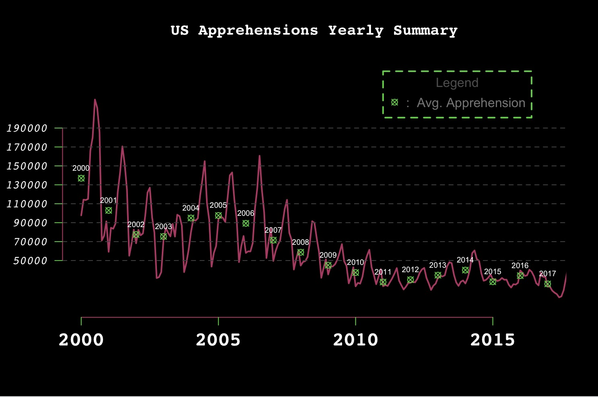

## Apprehension Summary Analysis

It is seen from the previous slide that Apprehensions throughout time have been slowly decreasing, and it is now as low as it once was back in the year 2011. This is being accredited to Donald Trumps aggression on border patrol and the desire to build a higher wall to prevent the US from having Mexicans or anybody fleeing their country to illegally cross the border into the states 

## Top 3 Month Periods with the most Apprehensions

Looking at the data and being able to manipulate and run a quick analysis on the apprehensions for both 2010 and 2017 we came up with the following conclusions for the most apprehensions in those years respectively by using the following R scrypt: 

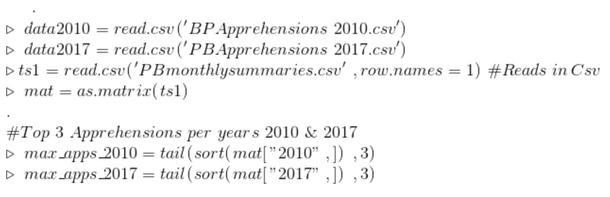

## Scrypt Output

Top 3 highest Apprehensions for the year 2010  | Top 3 highest Apprehensions for the year 2017
---------------------------------------------- | ---------------------------------------------
61361 for the month of March                   | 46184 for the month of October
55237 for the month of April                   | 47211 for the month of November
47045 for the month of May                     | 43251 for the month of December

<br>
<br> 

Depicted in the graph above It is noted that the maximum apprehensions for the year 2010 was 61361 for the month of March and the maximum apprehensions for the year 2017 was 47211 for the month of November.

## Change in Maximum Apprehensions

Using simple statistical tests like those demonstrated in class we were able to compare the sector with the most apprehensions for 2010 and with the sector with the most apprehensions in 2017. As stated in the previous slide It is noted that the maximum apprehensions for the year 2010 was in the month of March with 61361 and the maximum apprehensions for the year 2017 was in Novemeber with 47211. The difference in Apprehensions was a total of 14150. Noting that Apprehensions since the year 2010 are significantly lower now in 2018.  


## Data Visualizations

Using R's built-in plotting methods, we are able to visualize US-Mexico Apprehension data, comparing the 2010 and 2017 statistics by month and sector. By using simple statistical tests like those demonstrated in class we are able to demonstrate side by side visualizations of the years 2010 and 2017 comparing the data by sector.
In the following plots you will be able to visualize the differences in years According to sector Beggining with the Big Bend Sector.


## Big Bend Apprehension Analysis 

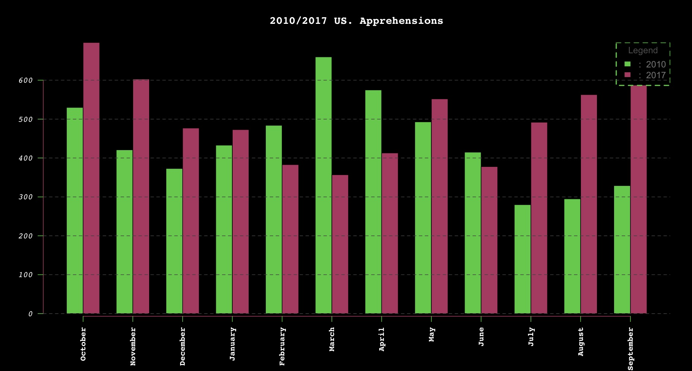

Depicted from the plot above it can be seen that the most apprehensions for this sector happened in the month of October in the year 2017


## Big Bend Table
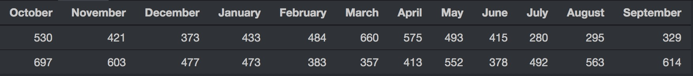


## Del Rio Apprehension Analysis

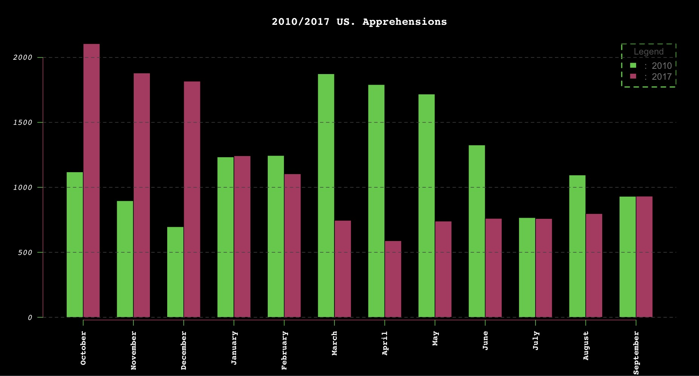

Depicted from the plot above it can be seen that the most apprehensions for this sector happened in the month of October in the year 2017

## Del Rio Table
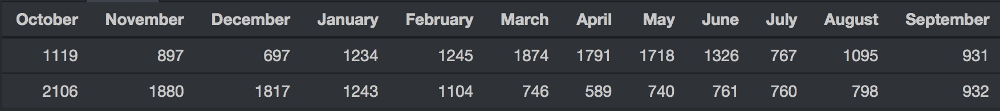


## El Centro Apprehension Analysis

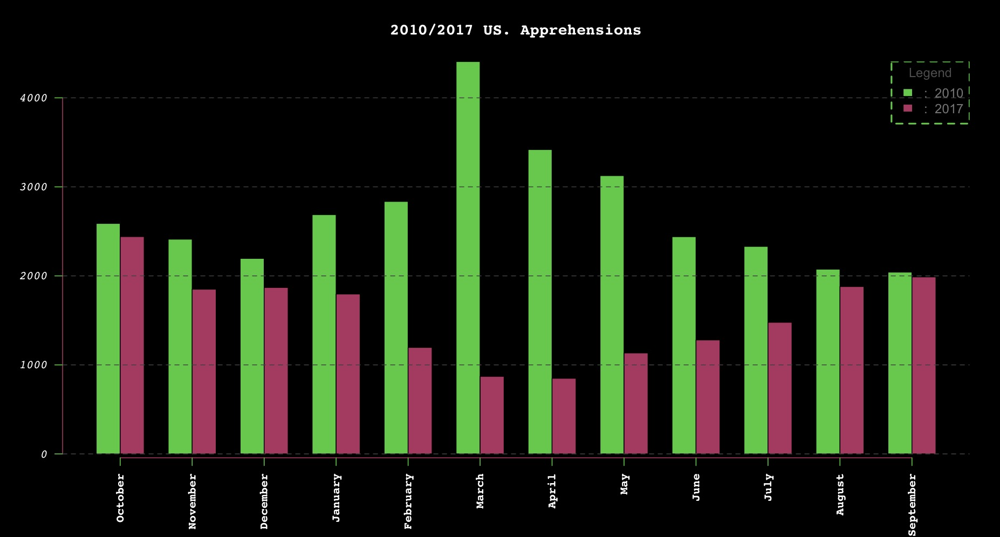

Depicted from the plot above it can be seen that the most apprehensions for this sector happened in the month of March in the year 2010

## El Centro Table
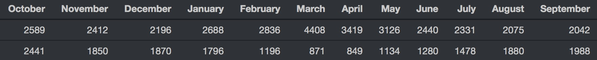


## El Paso Apprehension Analysis

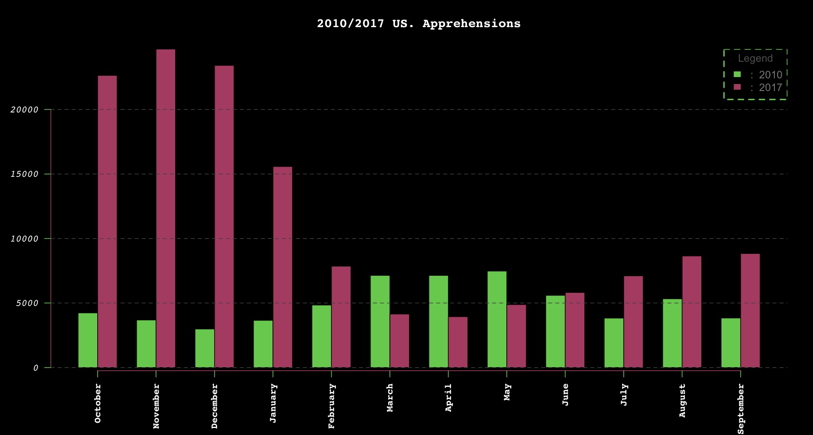

Depicted from the plot above it can be seen that the most apprehensions for this sector happened in the month of November in the year 2017

## El Paso Table
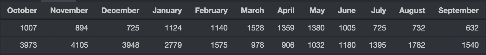


## Laredo Apprehension Analysis

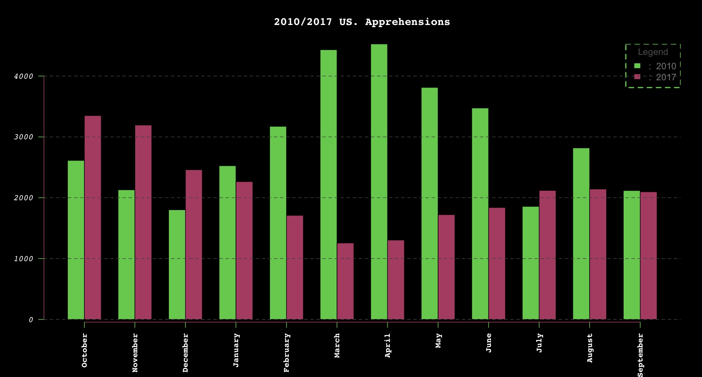

Depicted from the plot above it can be seen that the most apprehensions for this sector happened in the month of April in the year 2010

## Laredo Table
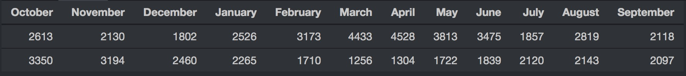


## Rio Grande Valley Apprehensions 

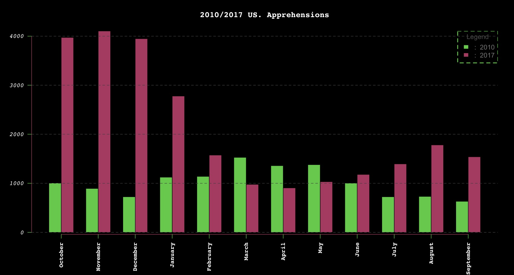

Depicted from the plot above it can be seen that the most apprehensions for this sector happened in the month of November in the year 2017

## Rio Grande Valley Table
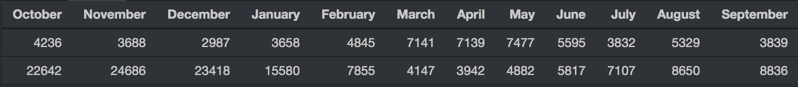


## SanDiego Apprehension Analysis 

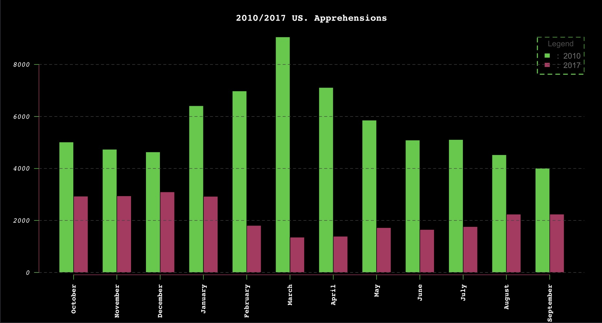

Depicted from the plot above it can be seen that the most apprehensions for this sector happened in the month of March in the year 2010

## SanDiego Table
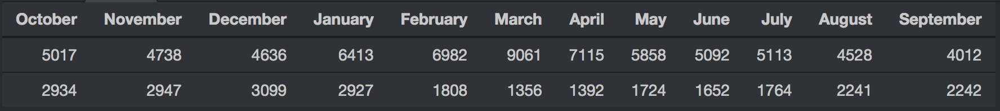


## Tucson Apprehension Analysis

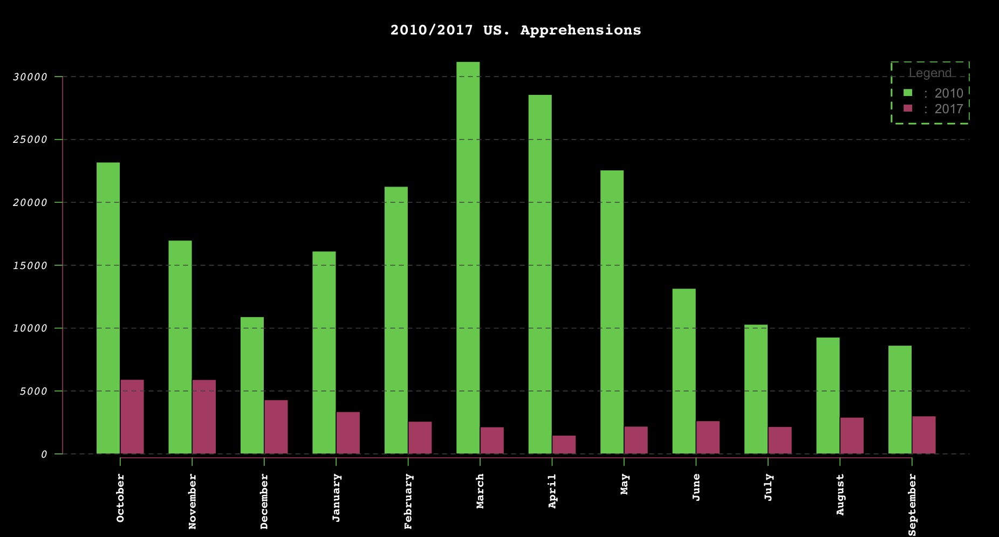

Depicted from the plot above it can be seen that the most apprehensions for this sector happened in the month of March in the year 2010

## Tucson Table
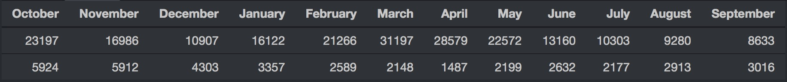


## Yuma Apprehension Analysis 

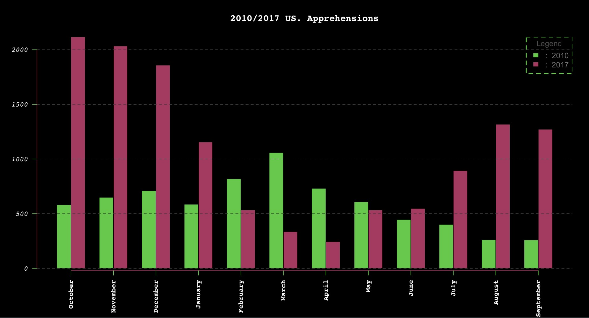

Depicted from the plot above it can be seen that the most apprehensions for this sector happened in the month of October in the year 2017

## Yuma Table
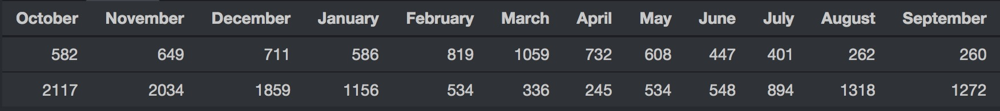


